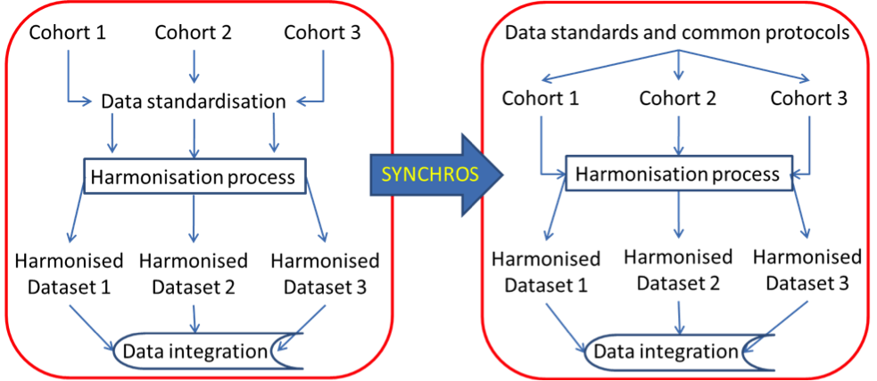

Recently there has been an exponential growth of cohort repositories and infrastructures where metadata and microdata are displayed and shared under certain rules and levels of restriction. These infrastructures make it easier for researchers to harmonise and integrate data for their purposes. For example, integrating data from international cohorts of the elderly population and health can lead to several significant advantages: it improves the generalizability and comparability of results between countries at different cultures and income levels, increases statistical power and helps to better analyse stratification and validation in personalized medicine in the presence of different comorbidities, gains efficiency and time in the use of existing longitudinal data, and makes better use of the invested resources that are of so much concern to public funders. 

However, the main problem is that the data collected among the different cohorts can be very heterogeneous, from different data formats to the very designs and objectives of the studies. Therefore, the quality of the integrated data depends very much on the harmonisation process that has been carried out. 

Data harmonisation is a very tedious process in terms of work and time since you need to know the cohorts thoroughly and to establish a balance between accuracy and validity when obtaining the new common variable. On the other hand, this process could be made easier if the cohorts followed standard data collection patterns and formats for future integration with data from other cohorts. This is where the SYNCHROS project wants to go. Apart from studying the existing methods, harmonisation and integration strategies will be analysed and established among stakeholders as good practice in the creation of new cohorts and future SYNCHROnisation.

